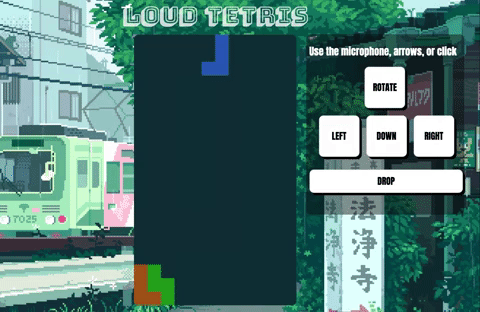

## LoudTetris

## [Live Link](https://hung3r.herokuapp.com/#/) 


*like tetris, but loud*


# Background
Loud tetris is a spinoff of the classic tetris game, where continuous falling objects of different shapes need to be arranged in a specific manner to clear the line
The twist is that, as a possible input, the pieces can be controlled voice commands (in addition to keyboard and mouse commands).

# Sample image



# Sample Code

 Using the following code, the object created by the WebSpeechAPI is parsed and converted into a string for a command.
```js
   for (let i = event.resultIndex, len = event.results.length; i < len; i++) {
      let transcript = event.results[i][0].transcript;
      if (event.results[i].isFinal === false) {
         event.results[i][0].transcript = "";
         transcript = transcript.split(" ");
         transcript.forEach( function(word) {
            words.push(word.toLowerCase());
            words = words.map(str => str.replace(/\s/g, '')).filter(function (word) { return word; });
            words = Array.from(new Set(words));
         })
      }
   }
```

Having to use the intermittent results because the full result takes too long to return, sometimes the same result (e.g. "left") is returned twice, thus, by using a throttle all those interpolations are allowed to be received and parsed correctly, preserving the original function.

```js
 recognition.onresult = throttle(function (event) {
   parseSpeech(event);
}, 1000);
```
 
# Architecture and Technologies
* Javascript and HTML5 serves as the base foundation for the game rendering and mechanics, and CSS3 styles the page itself. 
* Web Speech API is used for the voice to input controls
